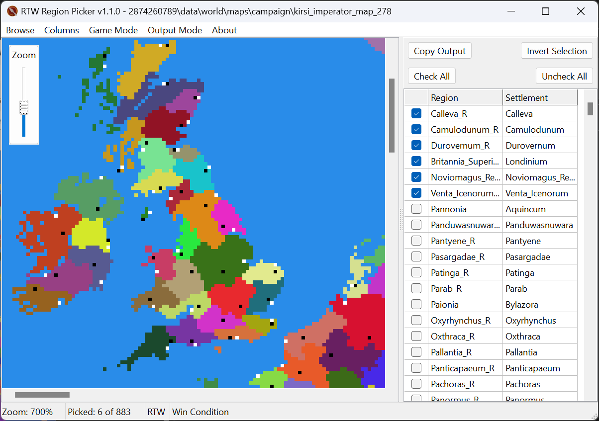

# RTW Region Picker

GUI app to pick regions from _Rome: Total War_ modifications. Selected regions are saved to `regions.txt` as a space-delimited list of provinces (merc pool option) or settlements (win conditions option). Output may also be saved to the clipboard.

**Note: The app will overwrite any previous `regions.txt` file, so please make backups if necessary.**

## Usage

**Game Mode**

Specify the Game Mode (RTW or BI) before browsing for a campaign folder. The app currently does not auto-detect whether a campaign uses BI's religion mechanic. The app will notify the user if a campaign folder was not read successfully; forgetting to specify the Game Mode is often the cause.

**Browse**

Browse for a campaign folder (e.g., `world\maps\campaign\imperial_campaign`). If a relevant file is not found, the app will look in `world\maps\base`. If a relevant file is still not found, the app will notify the user.

**Pick**

Pick a region by way of `CTRL + Left Click` on the map or by checking it in the spreadsheet. Repeat this process to unpick a region.

Buttons are provided to (un)check all regions and invert your selection.

Zoom the map by either using the provided slider or `CTRL + Mouse Wheel`.

Pan the map by `Left Click` and drag.

**Save**

The app automatically saves output to `regions.txt`. A button is provided to copy output to the clipboard.

If Output Mode is set to Merc Pool, provinces are saved. Setting the output to Win Conditions will save settlements.

## Download

Visit the [**Releases**](https://gitlab.com/eb-online/tools/rtw-region-picker/-/releases) page to download the latest package.

## Screenshot

Brought to you by the EB Online Team
